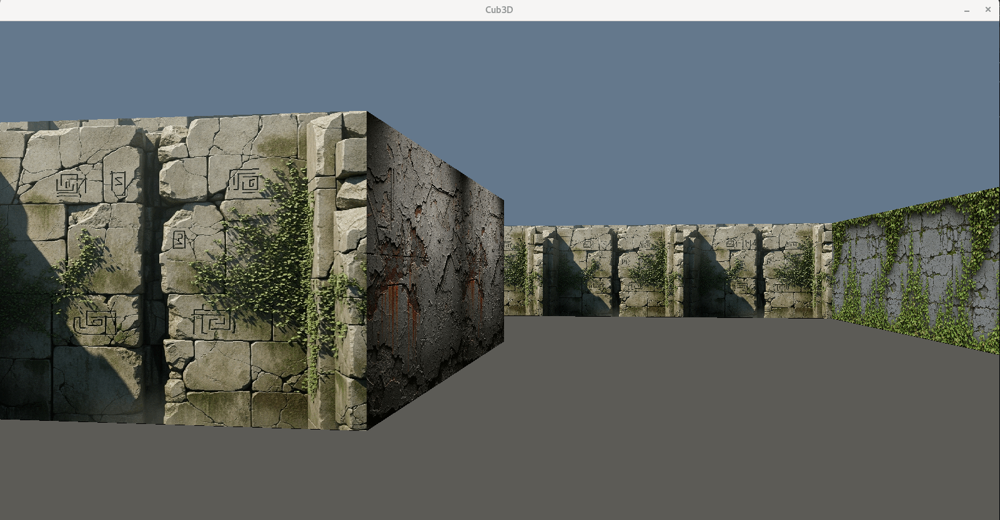
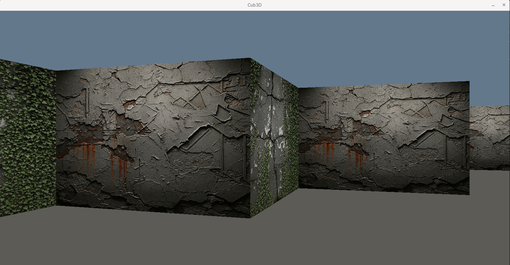
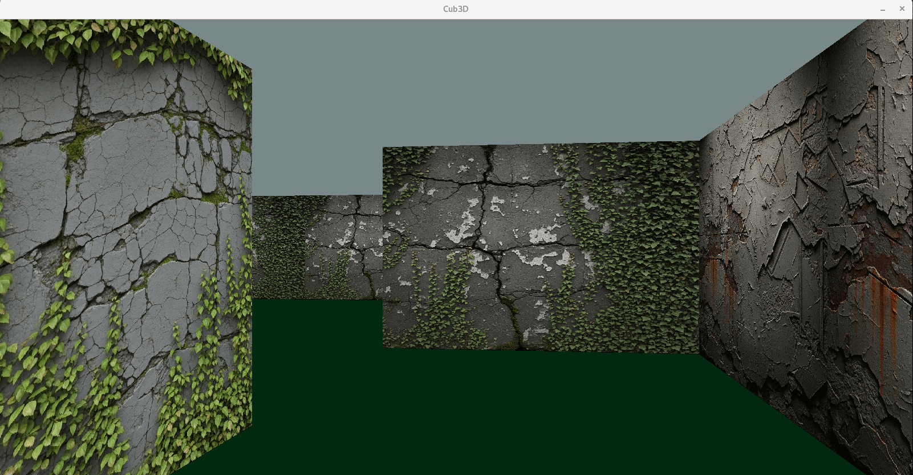
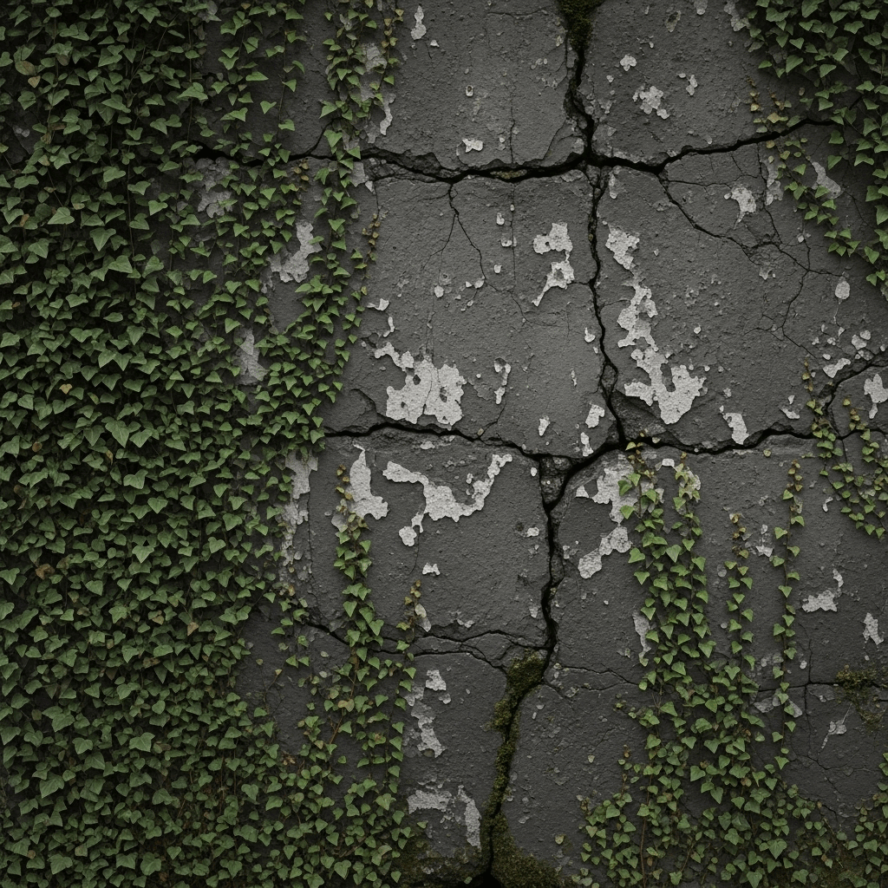
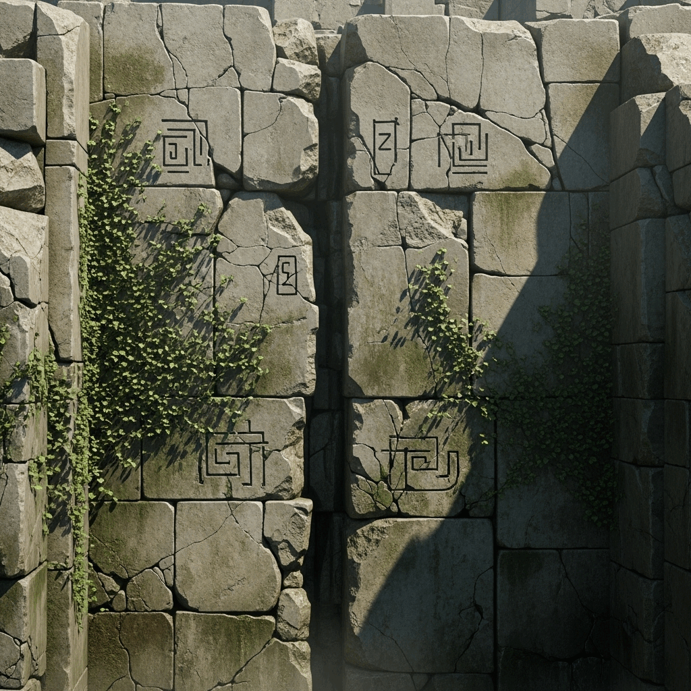
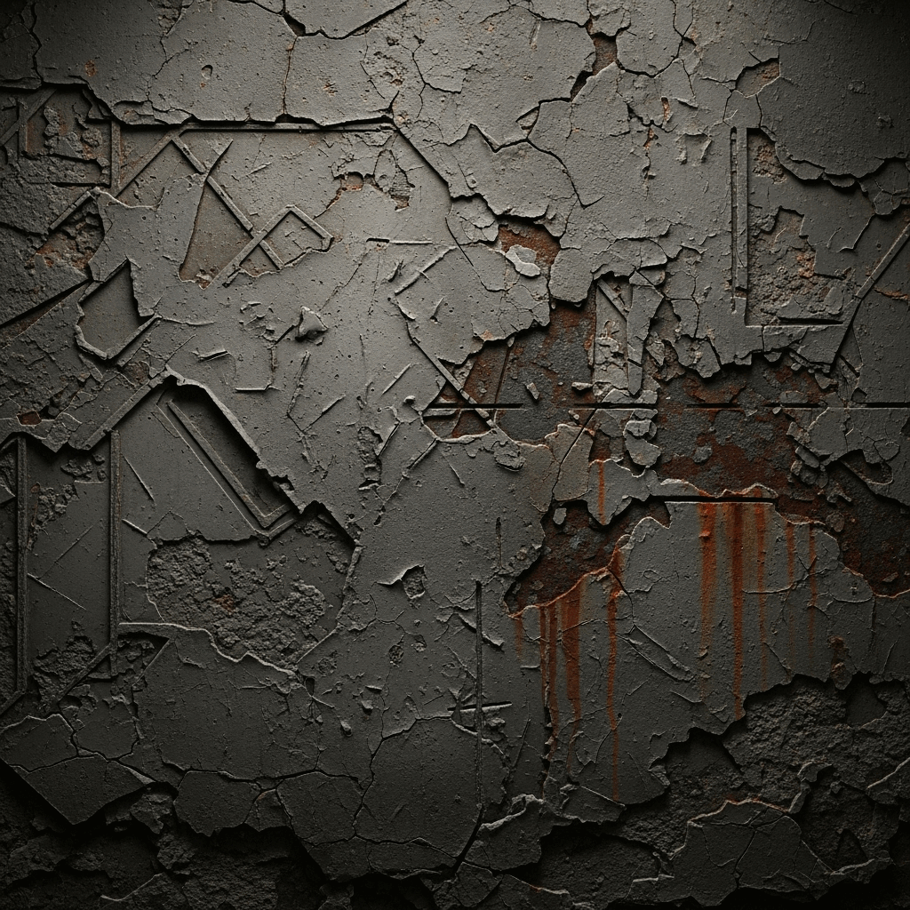

# 🌀 Cub3D – Maze Runner

> “The maze isn’t just walls... it’s a test of logic, math, and imagination.”

---

Cub3D – **Maze Runner** is a 3D maze exploration project developed in **C** using the **MiniLibX** graphical library as part of the **42 Amman curriculum**.  
The goal is to build a **raycasting engine** that transforms a 2D map into a fully interactive 3D world — inspired by classic first-person games like *Wolfenstein 3D*.  

You wake up inside a mysterious maze. The only way out? Follow the paths you create with your code.

---

## 🎮 About the Project

Cub3D reads a `.cub` file containing the maze layout, textures, and colors, and renders it in 3D using **raycasting**.  
The player can move, rotate, and explore the environment freely, with each wall and color dynamically drawn based on position and direction.

The project focuses on:
- Implementing **raycasting** from scratch  
- Rendering **walls**, **textures**, and **colored floors/ceilings**  
- Managing **keyboard input** and **real-time movement**  
- Parsing and validating **map files**  
- Practicing **mathematics, logic, and low-level graphics programming**

---




*Screenshots from the game showing different maze views*

---
## 🗺️ Example Map

`maps/valid_maps/map1.cub`

```text


SO ./textures/south.xpm
WE ./textures/west.xpm
NO ./textures/north.xpm
EA ./textures/east.xpm
F 92,91,86
C 100,120,140

        1111111111111111111111111
        1000000000110000000000001
        1011000001110000000000001
        1001000000000000000000001
111111111011000001110000000000001
100000000011000001110111111111111
11110111111111011100000000001
11110111111111011101110100001
11000000110101011100100101001
10000000000000001100100111001
10000000000000001101010000001
11000001110101011111011100E0111
11110111 1110101 101111010001
11111111 1111111 111111111111

```
- `NO`, `SO`, `WE`, `EA`: texture paths for each wall  
- `F`, `C`: floor and ceiling colors in RGB  
- Map grid: `1` = wall, `0` = space, `N` = player’s start position  
  
---

## 🧱 Textures Preview

| North | South | West | East |
|:------:|:------:|:------:|:------:|
|  |  |  |  |

---

## ⚙️ How to Run

To build and run **Maze Runner**, follow these steps:

```bash
# 1️⃣ Clone the repository
git clone https://github.com/fatimagh24/cub3d.git
cd cub3d

# 2️⃣ Build the project
make

# 3️⃣ Run the game with a map
./cub3D maps/maze.cub
